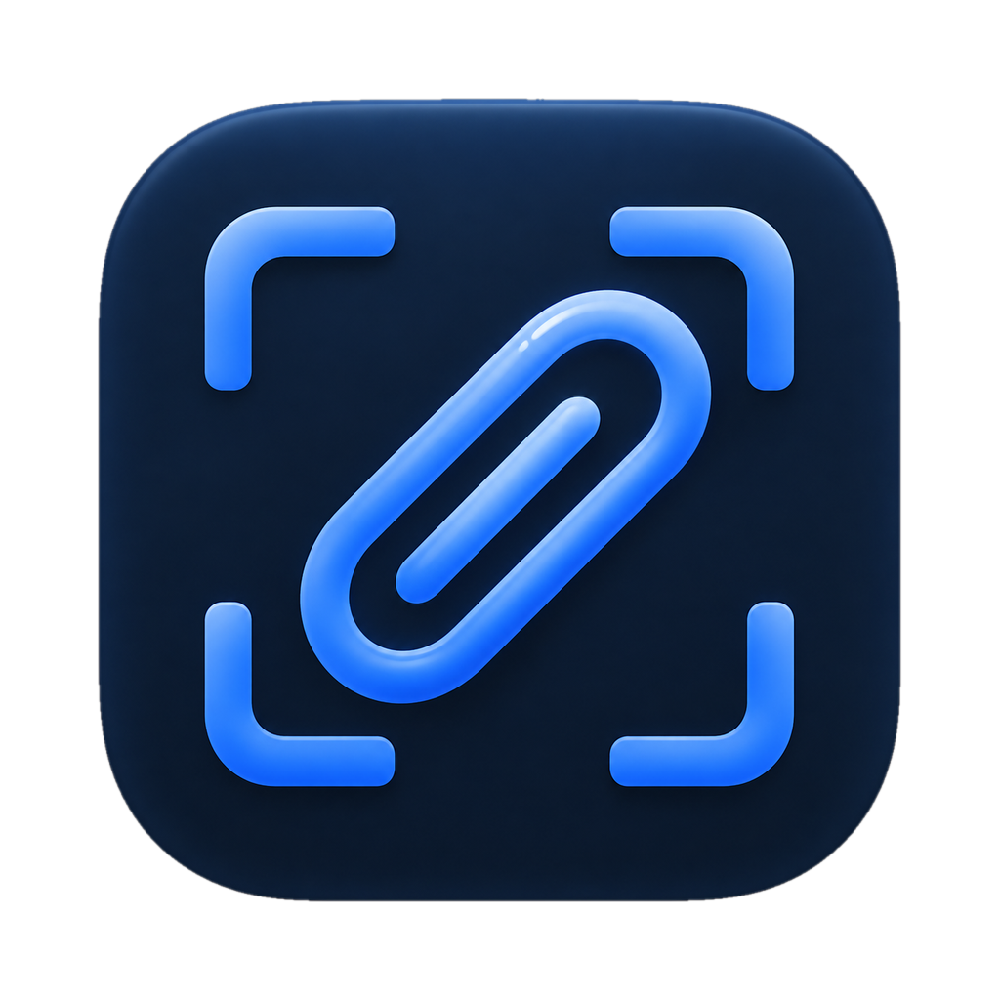
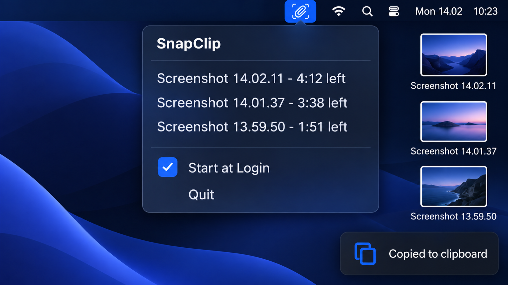

<p align="center"></p>

# SnapClip

A macOS menu-bar app that copies every screenshot to the clipboard and cleans up after itself.

## What it solves

macOS saves screenshots to the Desktop, so it fills up, and you must paste or drag each one by hand. SnapClip copies each new screenshot to the clipboard and keeps the Desktop tidy, without ever deleting a screenshot you chose to keep.



## Features

- Copies each new screenshot (Cmd+Shift+3, 4 or 5) to the clipboard as an image and file URL.
- The file stays in your screenshot folder.
- Keeps at most 5 tracked screenshots; a 6th moves the oldest to the Trash.
- Moves each tracked screenshot to the Trash 5 minutes after it appeared.
- Never touches a file you moved or renamed.
- Menu bar list with time left per screenshot, a Copy action for each, Start at Login, Open Screenshot Folder, Quit.

## Install

```sh
brew install 0xnicholasy/tap/snapclip
ln -sf "$(brew --prefix)/opt/snapclip/SnapClip.app" /Applications/SnapClip.app
open /Applications/SnapClip.app
```

First run: macOS asks whether SnapClip may access your Desktop folder (or whichever folder holds your screenshots). Allow it, or screenshots cannot be detected.

## Build from source

Requires macOS 14+ and the Swift toolchain (Xcode).

```sh
swift test
scripts/build-app.sh      # produces build/SnapClip.app, ad-hoc signed
open build/SnapClip.app
```

## How the rules work

- Watch folder: the `location` key of the `com.apple.screencapture` defaults domain, or `~/Desktop` if unset. It is re-read each time the app starts.
- Detection: a file counts as a screenshot only if it has the extended attribute `com.apple.metadata:kMDItemIsScreenCapture`. Dotfiles are ignored. SnapClip waits for the file size to stop changing before copying. Files that already existed at launch are never copied or tracked.
- Tracking: each screenshot is stored in `~/Library/Application Support/SnapClip/tracked.json` with its path, inode, device and time added.
- Still in place: a file is only SnapClip's to delete while a file at the original path has the same inode and device. If it was moved, renamed or replaced, SnapClip stops tracking it and never touches it.
- Sweep: every 10 seconds and after each new screenshot: drop files no longer in place, trash files tracked for 300 seconds or more, then trash the oldest while more than 5 are tracked. Trashing uses `FileManager.trashItem`, so files are recoverable.
- Start at Login: writes `~/Library/LaunchAgents/io.github.0xnicholasy.snapclip.plist` (runs `/usr/bin/open -a <app>` at login). Under Homebrew the path is rewritten to `<prefix>/opt/snapclip/...` so upgrades keep working. The toggle is checked when the plist exists; changes apply at next login.

## License

MIT
